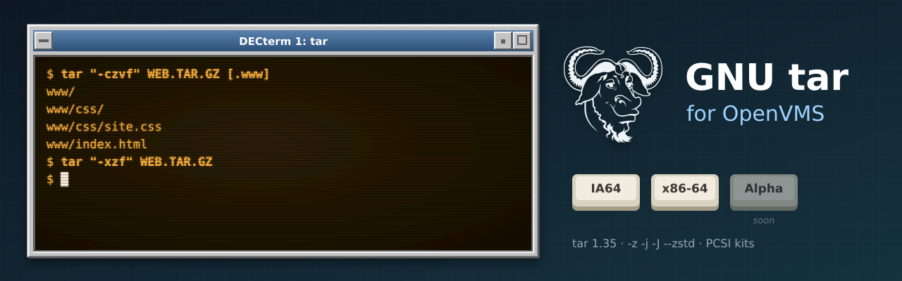

<p align="center">
  
</p>

# vms-tar

[](https://github.com/issinoho/vms-tar/releases/latest)
[](https://github.com/issinoho/vms-tar/releases)

[](COPYING)

GNU tar 1.35 for OpenVMS (IA64 and x86-64), built natively with VSI C.

The repository stores only our changes over the signed upstream release:
- `patches/` holds changes to upstream files, applied in `patches/series` order.
- `overlay/` holds new files: VMS build procedures, C RTL shims, the compressor bridge, the PCSI kit and the smoke test.

`tools/prepare.sh` combines them with the tarball into `staging/`, which is pushed to a VMS node and built there with MMS. The tooling is shared with the other ports in the family; see [vms-grep](https://github.com/issinoho/vms-grep) for the list.

## Status

| Step | IA64 (V8.4-2L3) | x86-64 (E9.2-4) |
|------|-----------------|-----------------|
| Build (`tools/build.sh`) | clean | clean |
| DCL smoke test, 27 checks (`tools/test.sh`) | 27/27 | 27/27 |
| PCSI kit `ISSINOHO <base> TAR V1.35-0E1` (`tools/kit.sh`) | built | built |
| Install check (`tools/installcheck.sh`): install, smoke 27/27, clean removal | pass | pass |

**Tested beyond the smoke test:**
- Text files in every VMS record format round-trip with exact member sizes: VAR, VFC, FIX with carriage control and Stream_LF.
- Archives made with `-z`, `-j`, `-J` and `--zstd` read correctly with GNU tar on Linux.

## Using it

```
$ @TAR$ROOT:[000000]TAR$SETUP.COM
$ tar "-czvf" WEB.TAR.GZ [.www]        ! [.www], www and www.dir all give members www/...
$ tar "-tvf" WEB.TAR.GZ
$ tar "-xf" WEB.TAR.GZ [.www]index.html
```

- **File names:** files can be named in either syntax. VMS names are converted to Unix member names, so the archive is the same either way and any tar can read it.
- **Compression:** `-z`, `-j`, `-J` and `--zstd` use the family's
  [gzip](https://github.com/issinoho/vms-gzip), [bzip2](https://github.com/issinoho/vms-bzip2),
  [xz](https://github.com/issinoho/vms-xz) and [zstd](https://github.com/issinoho/vms-zstd) kits.
- **Exit status:** failures have error severity under DCL.
- **Quoting:** quote options with capitals (`"-C"`, `"-T"`) unless the process uses `SET PROCESS/PARSE_STYLE=EXTENDED`.

## Workflow

```sh
cp tools/nodes.conf.example tools/nodes.conf   # then fill in the real nodes
tools/prepare.sh                               # fetch, verify, patch, configure, stage
tools/build.sh <ia64|x86> [ALL|CLEAN]          # push staging/ and build with MMS
tools/test.sh <node>                           # DCL smoke test
tools/kit.sh <node>                            # PCSI kit -> out/kits/
tools/installcheck.sh <node>                   # install kit, smoke-test it, remove (changes the system)
tools/vms_configure.sh <node>                  # once per upstream release: configure with VSI C
```

## VMS changes

| Patch / file | Why |
|---|---|
| `0001-vms-no-fork-system` + `vms/vms_tarsys.c`, `vms/vms_spawn.c` | No `fork()`. Compressed archives pass through a temporary file and the family's compressor kits, run with `LIB$SPAWN` |
| `0002-getprogname-vms` | gnulib `getprogname()` from the image name (`JPI$_IMAGNAME`) |
| `0003-stdlib-vms-exit-severity` + `vms/vms_exit.c` | Failures have error severity under DCL (exit 1, "files differ", is a warning); `$?` stays POSIX under GNV |
| `0004-config-h-assert-guard-vms` | VSI C's `<assert.h>` include guard defeats gnulib's re-include |
| `0005-stdio-fwrite-records-vms` + `vms/vms_fwrite.c` | Each `fwrite()` item became a record on record-oriented output |
| `0006-vms-no-remote-archives` | Every VMS file name with a device has a colon, so no name is a remote (`host:file`) archive |
| `0007-vms-record-file-sizes` + `vms/vms_datasize.c` | `st_size` of a record file counts record overhead, not the bytes `read()` returns ([D1](docs/DECISIONS.md)) |
| `0008-vms-open-directory-and-exit` | The C RTL cannot `open()` a directory: use gnulib's fallback. `main` exits through `vms_exit` |
| `0009-vms-unix-names` + `vms/vms_names.c` | VMS-syntax operands (`[.dir]`, `dir.dir`, `[.a]b.c;1`) become Unix names ([D2](docs/DECISIONS.md)) |
| `0010-vms-program-name` | Messages and usage said the full image path; now `tar` |
| `vms-manual.site` | Configure answers the cross run cannot get, such as the C RTL's `getcwd` |
| `vms/vms_crtl_init.c` | DECC$ features: ODS-5 names, Unix name reporting, argument case |

Every problem met and its fix is in [docs/PORTING_LOG.md](docs/PORTING_LOG.md).

**Known limits** (also in the kit's README.VMS):
- Extracted files are Stream_LF. A binary's record format is not restored, so use `SET FILE/ATTRIBUTES`.
- A compressed archive cannot be standard input or output.
- Remote archives, `--to-command`, `--info-script` and `--checkpoint-action=exec` are not available.

## Licence

GNU tar is free software under the GNU General Public License, version 3 or later;
see `COPYING`. Our patches and VMS files are distributed under the same terms.

## Artwork

`docs/images/banner.svg` and `docs/images/icon.svg` were made for this project in the style of
classic DECwindows and VT terminals, like those of its sibling ports. They incorporate the
[GNU head](https://www.gnu.org/graphics/heckert_gnu.html) by Aurelio A. Heckert, © 2003 Free
Software Foundation, Inc., used under the Creative Commons Attribution-ShareAlike 2.0 licence.
The two images are therefore also licensed under
[CC BY-SA 2.0](https://creativecommons.org/licenses/by-sa/2.0/).
